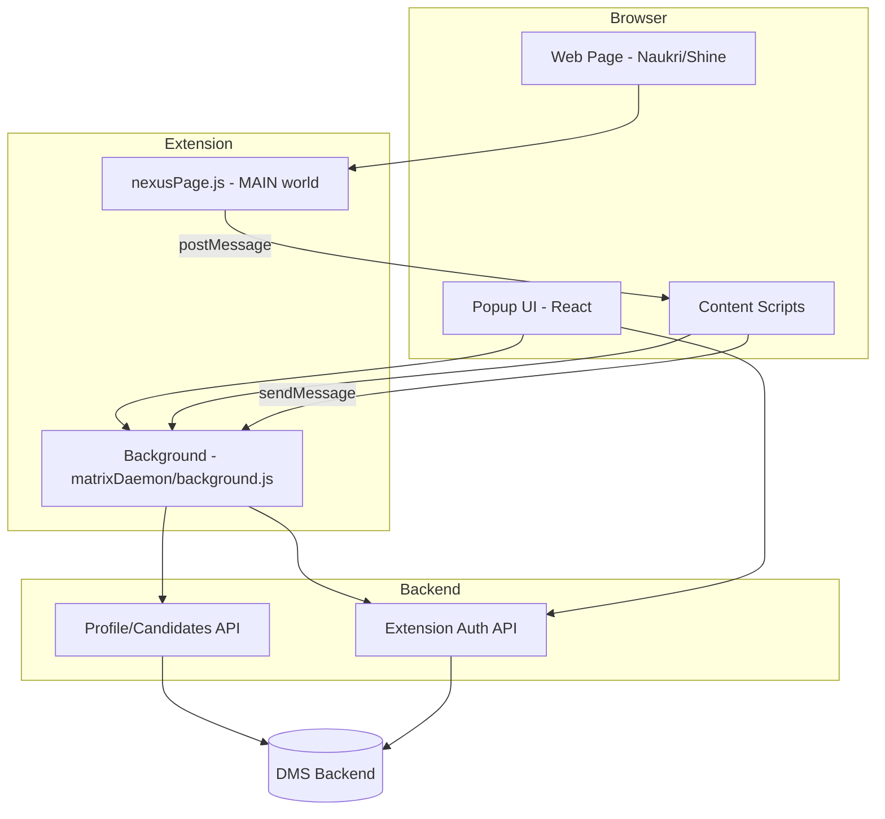
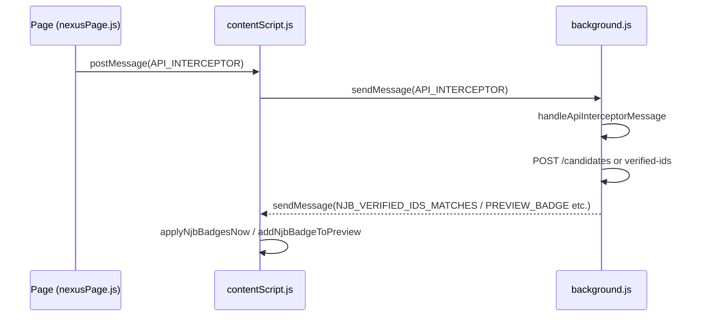
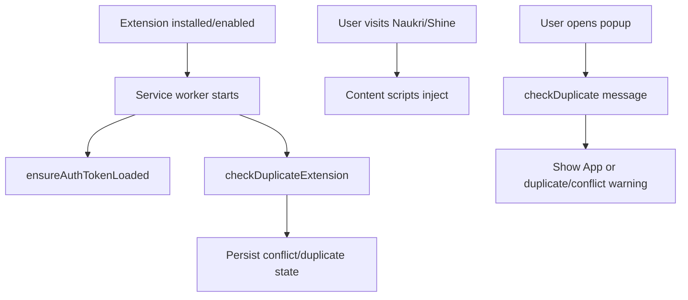
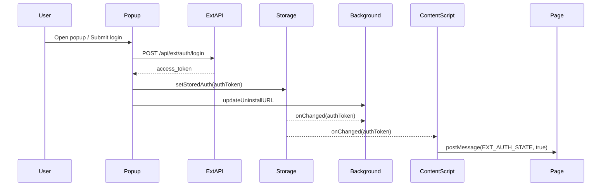
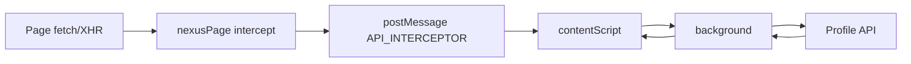
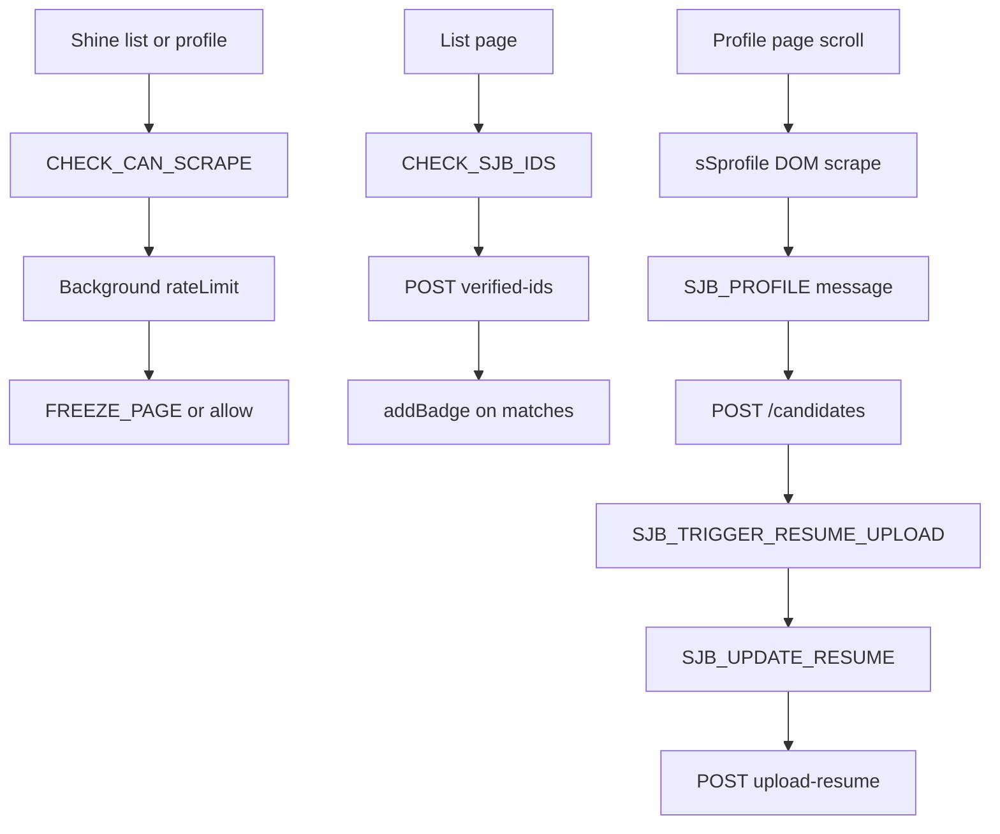
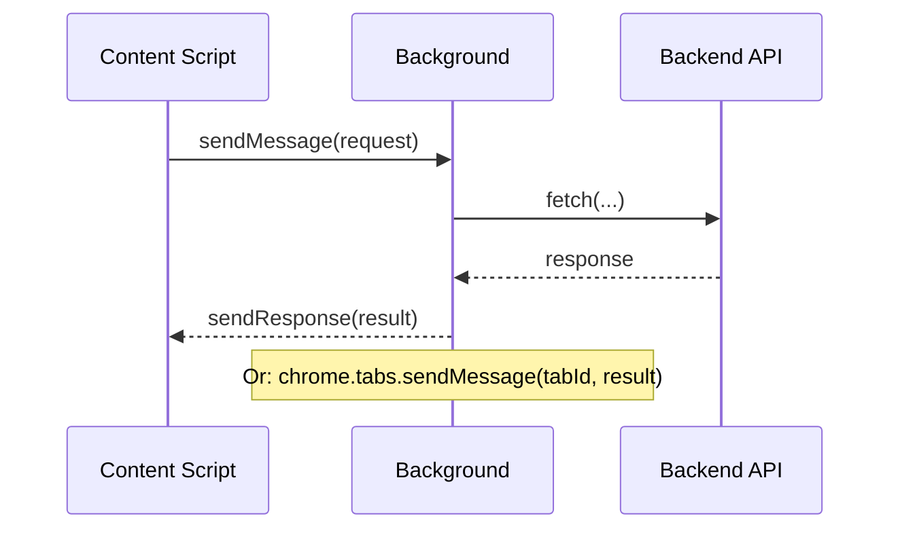
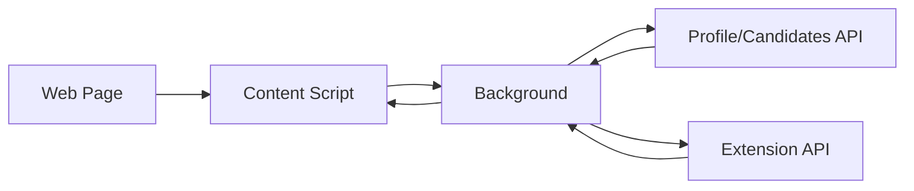

# Extension Technical Documentation

## 1. Project Overview

**What this extension does:**  
Team Collaboration Extension (DEV AI) is a Chrome Manifest V3 browser extension that integrates with job-board sites (Naukri, Naukri Gulf, Shine) to capture candidate profiles and resumes, sync them to a backend (DMS), and show “already in database” badges on candidate cards.

**Main purpose:**  
- Intercept profile and resume API responses on Naukri (Resdex, Hiring) and Shine.  
- Send candidate data to backend APIs (`/candidates`, `/candidates/verified-ids`, `/candidates/upload-resume`).  
- Show ✓ badges on search/preview/detail pages for candidates already in the database.  
- Support session import/share and rate limiting per customer.

**Key features:**  
- **Naukri (NJ/NJB):** API interception (fetch/XHR) on resdex.naukri.com and hiring.naukri.com; profile + contact + resume capture; verified-ids for list badges; Resdex route/URL monitoring.  
- **Naukri Hiring (NH):** Application-detail + contact-details + resume-download interception on hiring.naukri.com; combined candidate POST and resume upload.  
- **Shine (SJ/SJB):** DOM-based profile scraping on recruiter.shine.com; verified-ids for list badges; rate-limit check before scrape; resume download and upload.  
- **Popup:** Login (extension API auth), Home (Import/Share session), session share/import (Naukri-only in current flow).  
- **Duplicate/conflict detection:** Blocks work when another instance of the extension or another Naukri-targeting extension is enabled.

**Where it integrates:**  
- **Websites:** `*://*.naukri.com/*`, `*://*.naukrigulf.com/*`, `*://*.shine.com/*`, `*://recruiter.shine.com/*`.  
- **Backend APIs:**  
  - Profile/Candidates: `PROFILE_API_URL` (e.g. masterapi.eticaatest.co.in) — `/candidates`, `/candidates/verified-ids`, `/candidates/upload-resume`, `/customer_candidate_mapping`.  
  - Extension auth/limits: `ETICA_EXT_URL` (e.g. extensionapi.mydetest.co.in) — `/api/ext/auth/login`, `/profile/me`, `/scraping-limits/can-scrape`.  
- **Web app:** `WEB_APP_URL` (e.g. dms.eticaatest.co.in) for badge “view details” links.

---

## 2. High Level Architecture



**Folder structure**

```
extension/
├── public/                    # Extension source (copied + used in build)
│   ├── manifest.json           # MV3 manifest, content_scripts, background, host_permissions
│   ├── matrixDaemon.js        # Service worker entry (imports background.js)
│   ├── background.js          # Main background logic (auth, intercept handler, NJ/NH/SJB, session)
│   ├── contentScript.js       # Global content script (all_urls): screen info, Resdex, NJB badges, inject
│   ├── nexusPage.js           # Injected MAIN-world script: fetch/XHR intercept, resume trigger, Naukri
│   ├── js/
│   │   └── inject_naukri.js   # MAIN world on naukri.com: lightweight flag only
│   ├── background/
│   │   ├── core/              # auth, rateLimit, sessionImport, notifications, cookies, session
│   │   ├── njp/               # Naukri Hiring: ids.js, payload.js
│   │   ├── sjb/               # Shine: handlers.js
│   │   └── utils/             # dates.js, urls.js
│   ├── content/
│   │   ├── utils/             # contentScript.js (freeze/unfreeze), messaging.js, dom.js
│   │   └── sjb/               # extractor, converter, support, tools (Shine scraping + badges)
│   └── config/
│       └── constants.js       # PROFILE_API_URL, ETICA_EXT_URL, WEB_APP_URL, supportedDomains
├── src/                        # React popup (Vite build)
│   ├── App.jsx, main.jsx      # Routes, duplicate/conflict check
│   ├── pages/                  # Login, Home
│   ├── components/             # AuthGuard, Navbar, ImportSession, ShareSession, ExtensionUpdateModal
│   ├── config/                 # api.js, version.js
│   ├── service/                # socket.service.js
│   └── utils/                  # helper.jsx, deviceInfo.js
├── scripts/
│   ├── build.js               # Full extension build: Vite, copy public, obfuscate, validate
│   ├── obfuscate.js            # Obfuscate/minify JS in dist
│   └── ...
├── dist/                       # Built extension (load in Chrome)
│   ├── manifest.json
│   ├── matrixDaemon.js, background.js, contentScript.js, nexusPage.js
│   ├── index.html + JS/CSS bundles (popup)
│   └── background/, content/, config/, js/
└── manifest.json               # Not used at runtime; public/manifest.json → dist
```

**Folder responsibilities**

| Folder / file   | Responsibility |
|-----------------|----------------|
| `public/`       | Extension core: manifest, background, content scripts, injected script, shared config. |
| `public/background/` | Background modules: auth, rate limit, session import/export, NJ/NH/SJB handlers, utils. |
| `public/content/`    | Content script modules: freeze overlay, messaging, Shine DOM scraping and badges. |
| `public/config/`     | API base URLs and domain lists. |
| `src/`          | Popup UI (React): login, home, import/share session, auth guard. |
| `scripts/`      | Build pipeline: Vite, copy public assets, obfuscate, validate. |
| `dist/`         | Packed extension output for Chrome. |

---

## 3. File-Wise Explanation

### File: `public/manifest.json`

**Purpose:** Declares MV3 extension: permissions, host permissions, content scripts, background service worker, popup, web accessible resources.

**Responsibilities:**  
- Content scripts: (1) `js/inject_naukri.js` on `*.naukri.com` MAIN world at document_start; (2) `content/utils/contentScript.js` on resdex and on `<all_urls>`; (3) Shine scripts on `*.shine.com` / `recruiter.shine.com` (messaging, dom, contentScript, sjb/*).  
- Background: `matrixDaemon.js` as service worker (module).  
- Action: `index.html` as default popup.  
- Host permissions: naukri.com, naukrigulf.com, shine.com.  
- Web accessible: `nexusPage.js`.

**Execution:** Loaded by Chrome when the extension is loaded; defines when each script runs.

---

### File: `public/matrixDaemon.js`

**Purpose:** MV3 service worker entry; only imports `background.js`.

**Responsibilities:** Start the background script.

**Connections:** Referenced by `manifest.json` as `background.service_worker`. Imports `./background.js`.

**Execution:** Runs when the extension starts or when the service worker wakes.

---

### File: `public/background.js`

**Purpose:** Main background script: message router, Naukri/Shine/NH intercept handling, verified-ids, resume upload, session share/import, duplicate/conflict checks.

**Responsibilities:**  
- Listen `chrome.runtime.onMessage`: `checkDuplicate`, `API_INTERCEPTOR`, `PING`, `CHECK_CAN_SCRAPE`, `SJB_*`, `REQUEST_NJB_VERIFIED_IDS_REFRESH`, `CHECK_NJB_PROFILES`, `shareSession`/`importSession`/`logout`, `updateUninstallURL`, `getDomain`.  
- For `source === "API_INTERCEPTOR"`: call `handleApiInterceptorMessage` (profile/contact/resume/listing/NH application/contact/resume; merge and POST to `/candidates`, upload resume, send badges, verified-ids refresh).  
- Maintain in-memory state: profileByUserId, contactByUserId, backendCandidateIdByUserId, pendingResumeByUserId, NH maps, lastNjbVerifiedIdsPayload, conflict state.  
- Duplicate/conflict: `checkDuplicateExtension`, `getConflictState`, persist to storage; skip intercept work when conflict/duplicate.  
- Auth: `ensureAuthTokenLoaded`, `getAuthToken` from storage; subscribe to `storage.onChanged` for `authToken`.  
- Session: delegate to `sessionImport.js` (handleImportSession, handleExportSession, handleLogoutAndClearData, getDomain).  
- Helpers: `mapProfileResponseToCandidatesPayload`, `sendListingCandidatesData`, `postVerifiedIdsAndBroadcast`, `maybeSendCombinedCandidateToCandidatesApi`, `maybeSendNhCombinedCandidate`, `uploadResume`, `maybeMapCustomerToCandidateAfterResumeUpload`, date/phone/notice/experience formatting.

**Main functions:**  
- `handleApiInterceptorMessage(msg, sender)`  
- `maybeSendCombinedCandidateToCandidatesApi(userId)`  
- `maybeSendNhCombinedCandidate(applicationId)`  
- `sendListingCandidatesData(data)`  
- `postVerifiedIdsAndBroadcast(payload, force)`  
- `uploadResume(data, opts)`  
- `getConflictState()`, `handleCheckDuplicate(sendResponse)`

**Connections:** Imports from `background/core/auth.js`, `config/constants.js`, `background/njp/ids.js`, `background/njp/payload.js`, `background/sjb/handlers.js`, `background/core/rateLimit.js`, `background/core/sessionImport.js`. Sends messages to tabs (badges, freeze). Content script and popup send messages to it.

**Execution:** Runs in the service worker context when the extension is active; reacts to messages and storage changes.

---

### File: `public/contentScript.js`

**Purpose:** Content script on `<all_urls>` and Resdex: screen info, Resdex URL/search-state handling, relay for API interceptor, NJB badges, conditional injection of `nexusPage.js`.

**Responsibilities:**  
- `GET_SCREEN_INFO`: respond with screen dimensions and devicePixelRatio.  
- Resdex: detect `/v3/search` and `/v3/preview`; extract search state (sid, pageNo, so); on route change or results loaded call `REQUEST_NJB_VERIFIED_IDS_REFRESH` and `CHECK_CAN_SCRAPE` (debounced).  
- Listen for `window.postMessage` with `source === "API_INTERCEPTOR"`; forward to background via `chrome.runtime.sendMessage`; after that trigger Resdex `CHECK_CAN_SCRAPE`.  
- Auth: read `authToken` from `chrome.storage.local`; cache and post `EXT_AUTH_STATE` to page; if logged in and on naukri.com, inject `nexusPage.js` once.  
- NJB badges: on `NJB_VERIFIED_IDS_MATCHES` paint badges on search cards; on `NJB_PREVIEW_BADGE` / `NH_DETAIL_BADGE` paint on preview/hiring detail; on `NJB_REFRESH_BADGES` re-apply. MutationObserver on search page to re-apply badges when DOM changes.  
- Resdex URL monitoring: popstate, pushState/replaceState, polling, visibilitychange.

**Main functions:**  
- `triggerResdexCanScrapeCheck(reason)`  
- `triggerResdexVerifiedIdsAndCanScrape()`, `handleResdexUrlChange()`, `initResdexSearchHandling()`  
- `ensureInjectJsIfLoggedIn()`, `getAuthTokenFromStorage()`, `postAuthStateToPage(loggedIn)`  
- `addNjbBadgeToCard(card, candidateId)`, `addNjbBadgeToPreview(candidateId)`, `addNhBadgeToHiringDetails(candidateId)`  
- `applyNjbBadgesNow()`, `scheduleApplyNjbBadges(delayMs)`

**Connections:** Uses `chrome.runtime.sendMessage`, `chrome.storage.local`, `chrome.runtime.getURL("nexusPage.js")`. Receives messages from background (NJB_VERIFIED_IDS_MATCHES, NJB_PREVIEW_BADGE, NH_DETAIL_BADGE, NJB_REFRESH_BADGES). Page (nexusPage.js) sends API_INTERCEPTOR via postMessage.

**Execution:** Injected on matching URLs at document_start; runs in isolated world; listens to DOM and storage.



---

### File: `public/nexusPage.js`

**Purpose:** Injected into Naukri pages (MAIN world) to intercept fetch and XHR, capture profile/contact/resume responses, trigger resume download, and post captured data to the content script.

**Responsibilities:**  
- Listen for `EXT_AUTH_STATE` from content script; set `extLoggedIn`; only intercept when true.  
- Override `window.fetch`: after response, clone and inspect; if resume URL or target APIs (recruiter-js-profile-services, contactdetails, rm-application-detail-services), extract body (JSON or resume base64), then `postMessage({ source: "API_INTERCEPTOR", ... })`.  
- Override `XMLHttpRequest`: on load, same logic for resume vs JSON APIs; postMessage to content script.  
- Resdex preview: auto-click “View phone number” after delay if user hasn’t; mark contactdetails seen; trigger resume download from profile payload (`buildNaukriResumeUrl`, XHR to download URL).  
- Naukri Hiring: detect hiring detail page; from application-detail response trigger resume download (`buildNaukriHiringResumeUrl`, XHR); auto-click Contact button once.  
- Optional: block blob/download UX shortly after triggering resume (installCvDownloadBlocker).  
- Resume APIs: send `cvBuffer` (+ nh_jobId/nh_applicationId on hiring) in API_INTERCEPTOR message.

**Main functions:**  
- `triggerNaukriResumeDownloadIfPossible(payload, sourceUrl)`  
- `triggerNaukriHiringResumeDownloadIfPossible(payload, sourceUrl)`  
- `buildNaukriResumeUrl(jsprofile)`, `buildNaukriHiringResumeUrl(jobId, applicationId)`  
- `scheduleResdexViewPhoneAutoClick()`, `markResdexContactDetailsSeen()`  
- Fetch/XHR wrappers that postMessage on target URLs

**Connections:** Receives `EXT_AUTH_STATE` from content script (postMessage). Sends `API_INTERCEPTOR` to content script (postMessage). No direct chrome.* calls (runs in page context).

**Execution:** Loaded by content script when user is logged in and on naukri.com; runs in page window.

---

### File: `public/js/inject_naukri.js`

**Purpose:** Minimal MAIN-world script on `*.naukri.com` to set a single flag so the real logic in `nexusPage.js` can avoid double installation.

**Responsibilities:** Set `window.__naukri_main_world_inject_installed = true` once.

**Execution:** Injected at document_start on Naukri URLs by manifest.

---

### File: `public/content/utils/contentScript.js` (content folder)

**Purpose:** Shared content-script utilities: freeze overlay and freeze/unfreeze messaging for rate limit or session expiry.

**Responsibilities:**  
- `freezePage(message)`, `unfreezePage()`, `enableBlock()`, `disableBlock()` (block user events).  
- Listen for `FREEZE_PAGE` / `UNFREEZE_PAGE` from background; on certain hosts (skip list) do nothing.  
- On load on skipHosts, ensure page is unfrozen and block disabled.

**Connections:** Exposes globals for other content scripts. Background sends FREEZE_PAGE/UNFREEZE_PAGE to tabs. Used by Resdex and Shine content scripts.

**Execution:** Runs on Resdex and on Shine (and any other matches in manifest) at document_start.

---

### File: `public/content/utils/messaging.js`

**Purpose:** Safe messaging to background and auth token cache for content scripts (Shine).

**Responsibilities:**  
- `sendMessageToBackground(message)`, `isBackgroundScriptReady()` (PING), `sendMessageSafely(message, maxRetries)`.  
- `getAuthTokenFromStorage()`, `hasAuthToken()`; keep cache in sync with `storage.onChanged` for `authToken`.

**Connections:** Used by Shine content scripts. Talks to background via `chrome.runtime.sendMessage`.

**Execution:** Loaded on Shine URLs before other content scripts.

---

### File: `public/content/utils/dom.js`

**Purpose:** Small DOM/UX helpers for Shine content scripts.

**Responsibilities:** `getRandomDelay(min, max)`, `simulateClickWithoutEffect(element)` (no-op).

**Connections:** Referenced by Shine scripts (tools, extractor).

---

### File: `public/content/sjb/extractor.js`

**Purpose:** Shine profile scraping: extract full profile from DOM and send to background; rate-limit check and overlay.

**Responsibilities:**  
- `sSprofile()`: build `sjbProfile` from DOM (name, location, experience, education, skills, projects, certifications, resume link, etc.); download resume and convert to base64; call `transformSjbProfile`, then `postMessage(SJB_PROFILE_DATA)` and `sendMessageSafely({ type: "SJB_PROFILE", data, resumePdfData, resumeFileName })`.  
- Rate limit: `checkRateLimit()` → `CHECK_CAN_SCRAPE` to background; `checkAndBlockIfNeeded()`; show/hide rate limit overlay; block interactions when over limit.  
- Scroll-triggered scrape: on profile page, on scroll call `handleSc()` once (after rate limit check); 5s delay then run `sSprofile()` and send to background.  
- Listen for `SJB_TRIGGER_RESUME_UPLOAD` and send `SJB_UPDATE_RESUME` with candidateId and resume data.  
- Navigation: reset scrape state on popstate/pushstate/locationchange; on load and when returning to list run rate limit and (for list) refresh badges.

**Main functions:**  
- `sSprofile()`, `checkRateLimit()`, `checkAndBlockIfNeeded()`, `handleSc()`  
- `showRateLimitOverlay(limitInfo)`, `hideRateLimitOverlay()`, `blockAllInteractions()`, `unblockAllInteractions()`

**Connections:** Uses `transformSjbProfile` (converter.js), `downloadAndConvertCV` (tools.js), `sendMessageSafely` (messaging.js). Sends `SJB_PROFILE` to background. Uses `window.isSjbProfilePage` (tools.js).

**Execution:** Loaded on Shine; runs when DOM is ready and on scroll on profile page.

---

### File: `public/content/sjb/converter.js`

**Purpose:** Transform raw Shine profile object to backend candidate payload shape.

**Responsibilities:**  
- `transformSjbProfile(sjbProfile)`: map to contacts, addresses, work_experiences, educations, skills, projects, certifications, job_preference, job_board_unique_ids (shine_id), etc., and normalize dates/notice period.

**Connections:** Used by extractor.js. Uses `window.sjbHelpers` (support.js) for extractTitle, extractDegree, extractFieldOfStudy.

**Execution:** Called from extractor when profile is scraped.

---

### File: `public/content/sjb/support.js`

**Purpose:** Small helpers for Shine parsing.

**Responsibilities:**  
- `extractTitle(name)`, `extractStartDate`/`extractEndDate(duration)`, `extractDegree(course)`, `extractFieldOfStudy(course)`.

**Connections:** Exposed as `window.sjbHelpers`. Used by converter.js.

---

### File: `public/content/sjb/tools.js`

**Purpose:** Shine list and profile page helpers: CV download, profile-page detection, verified-ids and badges.

**Responsibilities:**  
- `downloadAndConvertCV(cvUrl, candidateName)`: fetch PDF with credentials, return base64.  
- `isSjbProfilePage()`: host + path and DOM (`.profile_top`, `.profile`, path `/search/profile/`).  
- `getSjbProfiles()`: from `.list-content` or `.profile_right` build list of { sjbProfileUniqID, element, data }.  
- `extractProfileData(card, sjbProfileUniqID)`, `extractProfilePageDetails(container, sjbProfileUniqID)`.  
- `checkSjbIds()`: get profiles, build `jobBoardFrontPageDetails`, send `CHECK_SJB_IDS` to background; on response add badges via `addBadge(profile)`.  
- MutationObserver on `.insta_search` to run `checkSjbIds` when list changes.  
- URL monitoring (popstate, pushState, replaceState, locationchange, visibilitychange) to refresh badges and trigger `CHECK_CAN_SCRAPE` on list pages.  
- Listen for `SJB_EXTRACT_AND_VERIFY_IDS`, `SJB_REFRESH_BADGES`.

**Main functions:**  
- `downloadAndConvertCV`, `isSjbProfilePage`, `getSjbProfiles`, `checkSjbIds`, `addBadge`, `initializeObserver`, `triggerCanScrapeCheck`

**Connections:** Background handles `CHECK_SJB_IDS` and sends `SJB_REFRESH_BADGES` / `SJB_EXTRACT_AND_VERIFY_IDS`. Extractor uses `downloadAndConvertCV`, `isSjbProfilePage`.

**Execution:** Loaded on Shine; runs on list and profile pages; observer and listeners run when DOM/URL changes.

---

### File: `public/background/core/auth.js`

**Purpose:** Read auth token from extension storage.

**Responsibilities:**  
- `getStoredAuth()`: `chrome.storage.local.get(["authToken"])` and return `{ storedToken }`.

**Connections:** Used by background.js, rateLimit.js, sjb/handlers.js.

---

### File: `public/background/core/rateLimit.js`

**Purpose:** Rate-limit check for scraping (Naukri NJ, Shine SJ); optionally freeze tab when limit exceeded.

**Responsibilities:**  
- `checkCanScrape(jobBoard)`: get token, decode userId, fetch `/profile/me` for customerId, then GET `ETICA_EXT_URL/scraping-limits/can-scrape?customerId=&userId=&jobBoard=`. Return `{ canScrape, reason, maxLimit, used, remaining, period }`. Treat 401/403 as UNAUTHORIZED (do not freeze).  
- Cache per jobBoard (30s).  
- `handleCheckCanScrape(message, sender, sendResponse)`: skip certain hosts/paths (Resdex/Shine allowlists); call `getCachedOrFetchRateLimit(jobBoard)`; if `shouldFreezeForRateLimit(result)` send `FREEZE_PAGE` to tab with message; sendResponse(result).

**Main functions:**  
- `checkCanScrape(jobBoard)`, `handleCheckCanScrape(message, sender, sendResponse)`  
- `freezeTabForRateLimit(tabId, limitInfo)`, `shouldFreezeForRateLimit(result)`

**Connections:** Imported by background.js. Content scripts (Resdex, Shine) send `CHECK_CAN_SCRAPE`; Resdex/Shine content may show local overlay (Shine in extractor.js).

---

### File: `public/background/core/notifications.js`

**Purpose:** Show Chrome notification.

**Responsibilities:**  
- `sendNotification(title, message)`: `chrome.notifications.create` with type basic, icon, title, message.

**Connections:** Used by background/sjb/handlers.js on profile save success/fail.

---

### File: `public/background/core/sessionImport.js`

**Purpose:** Re-export and optionally wrap session import/export/logout/domain from `session.js` and `cookies.js` for use by background.

**Responsibilities:**  
- `handleImportSession(sessionData, sendResponse)`, `handleExportSession(sendResponse)`, `handleLogoutAndClearData(sendResponse)`, `getDomain(sendResponse)`.  
- Normalize URL (resdex vs hiring vs shine), clear cache/cookies, validate session data, set cookies and storage in a tab, reload.

**Connections:** background.js calls these on `importSession`, `shareSession`, `logout`, `getDomain`. Session/cookies logic lives in session.js and cookies.js.

---

### File: `public/background/sjb/handlers.js`

**Purpose:** Handle Shine profile save and resume upload and verified-ids check.

**Responsibilities:**  
- `handleSjbProfile(message, sender, sendResponse)`: POST `message.data` to `PROFILE_API_URL/candidates`, then customer_ccandidate_mapping; send `SJB_PROFILE_SUCCESS` and optionally `SJB_TRIGGER_RESUME_UPLOAD` to tab; broadcast `SJB_REFRESH_BADGES` to Shine tabs and `SJB_EXTRACT_AND_VERIFY_IDS` to sender tab.  
- `handleSjbUpdateResume(message, sender, sendResponse)`: POST to `/candidates/upload-resume` with candidate_id, cvBuffer (resumePdfData), cv_updated_at; send success/error to tab.  
- `handleCheckSjbIds(message, sendResponse)`: POST to `PROFILE_API_URL/candidates/verified-ids` with jobBoard `sjb`, ids, jobBoardFrontPageDetails; return `{ matched: { byId, byName } }`.

**Connections:** background.js calls these for message types `SJB_PROFILE`, `SJB_UPDATE_RESUME`, `CHECK_SJB_IDS`. Content (extractor, tools) sends these messages.

---

### File: `public/background/njp/ids.js`

**Purpose:** Naukri Hiring URL/API detection and ID extraction.

**Responsibilities:**  
- `extractNhIdsFromPathname(pathname)` (e.g. `/hiring/<jobId>/apply/<applicationId>`).  
- `extractApplicationIdFromNhUrl(url)`.  
- `isNhApplicationDetailApi(url)`, `isNhContactDetailsApi(url)`, `isNhResumeDownloadApi(url)`.

**Connections:** background.js uses these to route NH intercept messages and correlate applicationId.

---

### File: `public/background/njp/payload.js`

**Purpose:** Map Naukri Hiring application + contact to backend payload and extract resume date.

**Responsibilities:**  
- `mapNhApplicationToCandidatesPayload(applicationDetail, contactDetails)` (not used in background.js; background builds “profileLike”/“contactLike” inline for NH).  
- `extractCvUpdatedAtFromNhApplication(applicationDetail)` for resume upload.

**Connections:** background.js imports `extractCvUpdatedAtFromNhApplication`. ids.js used with payload shapes in background.

---

### File: `public/config/constants.js`

**Purpose:** Central API URLs and domain list.

**Responsibilities:**  
- Export `PROFILE_API_URL`, `ETICA_EXT_URL`, `WEB_APP_URL`, `supportedDomains`.

**Connections:** Used by background.js, rateLimit.js, sjb/handlers.js. Content scripts (contentScript.js, tools.js) may duplicate WEB_APP_URL for badge links.

---

### File: `src/main.jsx` (Popup)

**Purpose:** Popup entry: duplicate/conflict check then render App or warning.

**Responsibilities:**  
- On load, `chrome.runtime.sendMessage({ action: "checkDuplicate" })`.  
- If `response.conflict` render DuplicateExtensionWarning.  
- If `response.naukriConflicts?.length` render NaukriConflictWarning.  
- Else render App in BrowserRouter.

**Connections:** background.js handles `checkDuplicate`. App contains routes and AuthGuard.

**Execution:** Runs when popup (index.html) is opened.

---

### File: `src/App.jsx`

**Purpose:** Define popup routes and wrap pages with AuthGuard where needed.

**Responsibilities:**  
- Routes: `/`, `/index.html`, `/home` → AuthGuard(Home); `/login` → Login; `/import-session` → AuthGuard(ImportSession); `/share-session` → AuthGuard(ShareSession); fallback → Home.  
- No layout wrapper; Navbar is inside Home/other pages as needed.

**Connections:** Uses AuthGuard, Login, Home, ImportSession, ShareSession.

---

### File: `src/components/AuthGuard.jsx`

**Purpose:** Protect routes by checking extension auth and optionally socket force-logout.

**Responsibilities:**  
- Read `getStoredAuth()`; if no token, set unauthenticated and redirect to `/login`.  
- If token, set authenticated and call `GET API_URL/api/ext/profile/me` with Bearer and x-chrome-version.  
- On 401/403: set forceLogoutMessage in storage, then set unauthenticated (user sees message on Login).  
- On success: `connectSocket(forceLogoutCallback, storedToken)` to listen for force-logout from backend.

**Connections:** Uses api.js (API_URL), socket.service, helper (getStoredAuth, logOutAndClearCookies). Wraps Home, ImportSession, ShareSession.

---

### File: `src/pages/Login.jsx`

**Purpose:** Extension login UI and token storage.

**Responsibilities:**  
- Form: email, password; validation; submit to `API_URL/api/ext/auth/login` with device info (browser, OS, extension_version, deviceInfo).  
- On success: `setStoredAuth({ authToken: accessToken })`, `chrome.runtime.sendMessage({ action: "updateUninstallURL", token })`, navigate to `/home`.  
- Handle 409 (already logged in elsewhere) with confirm flow.  
- Show version and build info.

**Connections:** api.js, version.js, helper (setStoredAuth), deviceInfo. Background handles updateUninstallURL.

---

### File: `src/pages/Home.jsx`

**Purpose:** Home screen after login: Import and Share session links, version info.

**Responsibilities:**  
- Two cards: “Import - Get Started” → `/import-session`, “Share - Collaborate with team” → `/share-session`.  
- Navbar (with optional extension update modal).  
- Display extension version and Chrome version.

**Connections:** Navbar, version, React Router navigate.

---

### File: `src/config/api.js`

**Purpose:** Expose backend base URL for popup.

**Responsibilities:**  
- `export const API_URL = import.meta.env.VITE_API_URL`.

**Connections:** Used by Login, AuthGuard, and any popup code calling extension auth API.

---

### File: `scripts/build.js`

**Purpose:** Full extension build pipeline.

**Responsibilities:**  
- Clean `dist/`.  
- Run Vite build (`npm run build`).  
- Copy from `public/`: manifest.json, root assets, folders (core, js, background, content, config).  
- Run obfuscate (unless `--no-obfuscate`).  
- Validate: required files (manifest.json, matrixDaemon.js, background.js, contentScript.js, nexusPage.js) and at least one JS bundle.

**Connections:** Calls npm scripts; writes to dist. Vite builds from index.html and outputs to dist (popup assets).

---

## 4. Core Workflows

### 4.1 Extension installation / startup

1. User installs or enables extension.  
2. Chrome starts service worker (`matrixDaemon.js` → `background.js`).  
3. `ensureAuthTokenLoaded()` runs; `checkDuplicateExtension()` runs and persists conflict state.  
4. Content scripts inject on matching URLs when user visits Naukri/Shine.  
5. Popup opens from action; main.jsx sends `checkDuplicate`; then App or warning is shown.



---

### 4.2 User login (popup)

1. User opens popup, hits Login (or AuthGuard redirects to `/login`).  
2. Login form submits to `API_URL/api/ext/auth/login` with email, password, device info.  
3. Backend returns access token.  
4. Popup calls `setStoredAuth({ authToken })` and `chrome.runtime.sendMessage({ action: "updateUninstallURL", token })`.  
5. Background and content scripts receive updated token via `storage.onChanged`; content script can inject nexusPage.js on Naukri and post EXT_AUTH_STATE.



---

### 4.3 Naukri Resdex: API interception and candidate save

1. User is on resdex.naukri.com (search or preview), logged in; content script has injected nexusPage.js and sent EXT_AUTH_STATE true.  
2. Page fetches/XHRs: recruiter-js-profile-services (preview), contactdetails (preview), or search listing (tuples).  
3. nexusPage.js intercepts response, posts API_INTERCEPTOR (url, data, pathname) to window.  
4. contentScript.js receives postMessage, sends same payload to background via sendMessage.  
5. background.js handleApiInterceptorMessage:  
   - Listing (tuples): sendListingCandidatesData → build frontPageDetails, POST verified-ids, broadcast NJB_VERIFIED_IDS_MATCHES to Naukri tabs.  
   - Profile + contact on preview: merge by userId, when both available call maybeSendCombinedCandidateToCandidatesApi → POST /candidates; on response get candidateId, flush pending resume if any, send NJB_PREVIEW_BADGE, refresh verified-ids and NJB_REFRESH_BADGES.  
   - Resume: buffer by userId or upload if backendCandidateId already exists; after candidate save upload resume and call customer_candidate_mapping.  
6. Content script receives NJB_VERIFIED_IDS_MATCHES / NJB_PREVIEW_BADGE and paints badges.



---

### 4.4 Naukri Hiring: application + contact + resume

1. User is on hiring.naukri.com detail page (`/hiring/<jobId>/apply/<applicationId>`).  
2. Page requests application-detail and contact-details (and resume download).  
3. nexusPage.js intercepts and posts API_INTERCEPTOR for each; may trigger resume XHR.  
4. Content script forwards to background.  
5. background.js: for applicationId stores app detail and contact in nhAppDetailByApplicationId, nhContactByApplicationId; when both present calls maybeSendNhCombinedCandidate(applicationId).  
6. maybeSendNhCombinedCandidate builds profileLike/contactLike, POSTs /candidates with source NH; on response stores backend candidateId, uploads buffered resume if any, sends NH_DETAIL_BADGE to tab.  
7. Resume intercept: if backend candidateId exists, upload immediately; else buffer in nhResumeByApplicationId until candidate is created.

---

### 4.5 Shine: profile scrape and verified-ids

1. User is on recruiter.shine.com (list or profile).  
2. On load (and navigation) content runs rate limit: sendMessage CHECK_CAN_SCRAPE (jobBoard SJ). Background rateLimit.handleCheckCanScrape may send FREEZE_PAGE.  
3. List page: tools.js getSjbProfiles + checkSjbIds → sendMessage CHECK_SJB_IDS with ids and jobBoardFrontPageDetails. Background handleCheckSjbIds POSTs verified-ids, returns matched; content addBadge on matched cards.  
4. Profile page: extractor.js on scroll runs handleSc → after delay sSprofile() (DOM scrape + resume download), transformSjbProfile, sendMessage SJB_PROFILE with data and resumePdfData.  
5. background handleSjbProfile POSTs /candidates, then customer_ccandidate_mapping, sends SJB_PROFILE_SUCCESS and SJB_TRIGGER_RESUME_UPLOAD to tab; broadcasts SJB_REFRESH_BADGES.  
6. Content on SJB_TRIGGER_RESUME_UPLOAD sends SJB_UPDATE_RESUME; background handleSjbUpdateResume POSTs upload-resume.



---

### 4.6 Session share (export) and import

**Export (Share):**  
1. User is on a Naukri tab, opens popup, goes to Share session.  
2. Popup sends `action: "shareSession"` (or equivalent).  
3. background handleExportSession: get active tab URL, ensure Naukri; get cookies for URL, localStorage and sessionStorage via scripting; sendResponse with status and data (cookies, storage).  
4. Popup shows/share serialized session.

**Import:**  
1. User has session data (from another device/user).  
2. Popup sends `action: "importSession", sessionData`.  
3. background handleImportSession (or sessionImport): validate URL (Naukri only in current flow), clear cache/cookies for domain, create temp tab, set cookies, set localStorage/sessionStorage, reload tab, sendResponse success/failure.

---

## 5. Messaging System

- **Content → Background:** `chrome.runtime.sendMessage(message, callback)`.  
- **Background → Tab:** `chrome.tabs.sendMessage(tabId, message).catch(...)`.  
- **Page → Content:** `window.postMessage` (e.g. API_INTERCEPTOR, EXT_AUTH_STATE).  
- **Popup → Background:** `chrome.runtime.sendMessage` (checkDuplicate, updateUninstallURL, shareSession, importSession, logout, getDomain).

Important message types:

| Type / action              | Direction        | Purpose |
|----------------------------|------------------|--------|
| API_INTERCEPTOR            | Page → CS → BG   | Relay intercepted API payload |
| CHECK_CAN_SCRAPE           | CS → BG          | Rate limit check (NJ/SJ) |
| REQUEST_NJB_VERIFIED_IDS_REFRESH | CS → BG  | Resdex: refresh verified-ids |
| CHECK_NJB_PROFILES         | CS → BG          | Verified-ids for list (legacy/alternate) |
| NJB_VERIFIED_IDS_MATCHES   | BG → Tab         | Paint list badges (Naukri) |
| NJB_PREVIEW_BADGE / NH_DETAIL_BADGE | BG → Tab | Paint preview/hiring badge |
| NJB_REFRESH_BADGES         | BG → Tab         | Re-apply list badges |
| SJB_PROFILE / SJB_UPDATE_RESUME | CS → BG   | Shine profile and resume upload |
| CHECK_SJB_IDS               | CS → BG          | Shine verified-ids |
| SJB_REFRESH_BADGES / SJB_EXTRACT_AND_VERIFY_IDS | BG → Tab | Shine badge refresh |
| FREEZE_PAGE / UNFREEZE_PAGE | BG → Tab         | Rate limit overlay |
| checkDuplicate / shareSession / importSession / logout / updateUninstallURL / getDomain | Popup → BG | Popup actions |



---

## 6. Data Flow

- **Naukri:** Page (fetch/XHR) → nexusPage.js (intercept) → postMessage → contentScript.js → sendMessage → background.js → Profile API (candidates, verified-ids, upload-resume); background → tabs (badges, freeze).  
- **Shine:** DOM → content/sjb (extractor, tools) → sendMessage → background → Profile API; verified-ids and badges back to same tab or all Shine tabs.  
- **Auth:** Popup login → storage.authToken; background and content read token; content posts EXT_AUTH_STATE to page.  
- **Rate limit:** Content sends CHECK_CAN_SCRAPE; background calls Extension API can-scrape; background may send FREEZE_PAGE; Shine content can also show local overlay.



---

## 7. Important Utilities / Helpers

- **Dates:** `background/utils/dates.js` (if present); in background.js: `toYyyyMmDd`, `formatLocalDateString`, `millisToIsoDate`, `toIsoDateString`.  
- **URLs:** `background/utils/urls.js`; Naukri URL normalization in background and sessionImport.  
- **Auth:** `background/core/auth.js` getStoredAuth; popup `src/utils/helper.jsx` getStoredAuth, setStoredAuth, logOutAndClearCookies.  
- **Config:** `public/config/constants.js` PROFILE_API_URL, ETICA_EXT_URL, WEB_APP_URL.  
- **Payload mapping:** background.js `mapProfileResponseToCandidatesPayload` (NJ/NH profile+contact → backend schema); Shine `content/sjb/converter.js` transformSjbProfile.  
- **Notice/experience:** background.js `abbreviateNoticePeriod`, `normalizeTotalExperienceToYm` for NJ/NH.

---

## 8. Error Handling

- **Background:** try/catch around message handler; sendResponse({ error }) on failure; async handlers return true to keep channel open.  
- **Interceptor:** Errors in fetch/XHR interceptors logged; postMessage still sent when possible so one failing parse does not block others.  
- **Rate limit:** 401/403 from can-scrape or profile/me → do not freeze (UNAUTHORIZED); other API errors → allow scrape (API_ERROR); missing token/customerId → no freeze.  
- **Duplicate/conflict:** When conflict or duplicate is set, background skips all intercept and verified-ids work; no throw.  
- **Resume upload:** Failures logged; customer_candidate_mapping best-effort.  
- **Popup:** Login network errors show message; AuthGuard keeps “authenticated” on network failure to avoid locking user out.  
- **Content:** sendMessage callbacks often ignore lastError; FREEZE_PAGE/tabs.sendMessage use .catch so missing tab or context does not crash worker.

---

## 9. Future Developer Notes

- **New features / UI:** Add routes and components in `src/`; protect with AuthGuard if they require login.  
- **New API calls:**  
  - Backend (candidates, verified-ids, upload-resume): add fetch in `public/background.js` or in a dedicated handler under `public/background/`.  
  - Extension auth/limits: use `ETICA_EXT_URL` and token from `getStoredAuth` / background auth cache; add URL in `public/config/constants.js` if needed.  
- **Parsing / intercept logic:**  
  - Naukri: intercept rules and payload shapes in `public/nexusPage.js` (fetch/XHR) and in `public/background.js` (handleApiInterceptorMessage, mapProfileResponseToCandidatesPayload, NH profileLike/contactLike).  
  - Shine: DOM selectors and extraction in `public/content/sjb/extractor.js` and `public/content/sjb/tools.js`; backend payload in `public/content/sjb/converter.js`.  
- **New job board:**  
  - Add host permissions and content script matches in `public/manifest.json`.  
  - Add content script(s) to inject and/or scrape and send messages (e.g. PROFILE, CHECK_IDS).  
  - In background, add message handlers and optional rate-limit path; reuse or duplicate verified-ids/candidates flow.  
- **Be careful:**  
  - MAIN world (nexusPage.js, inject_naukri.js) cannot use chrome.*; use postMessage to content script.  
  - Service worker can be killed; avoid long synchronous work; use storage for state that must survive restart.  
  - Duplicate/conflict check must run before doing any intercept or verified-ids work.  
  - Resdex verified-ids are driven by listing intercept (tuples) and refresh-after-save; do not call verified-ids from content script for Resdex list.  
  - Shine rate limit: content script shows overlay and blocks interaction; background may also send FREEZE_PAGE; keep skip hosts and path allowlists in sync (rateLimit.js vs content).  
  - Constants (PROFILE_API_URL, ETICA_EXT_URL, WEB_APP_URL) are duplicated in content (e.g. tools.js, contentScript.js) for badge links; change in one place may require updating the other.
