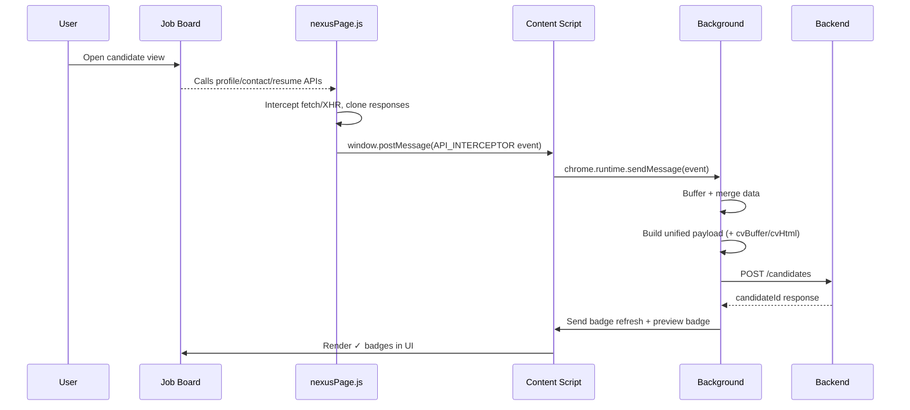
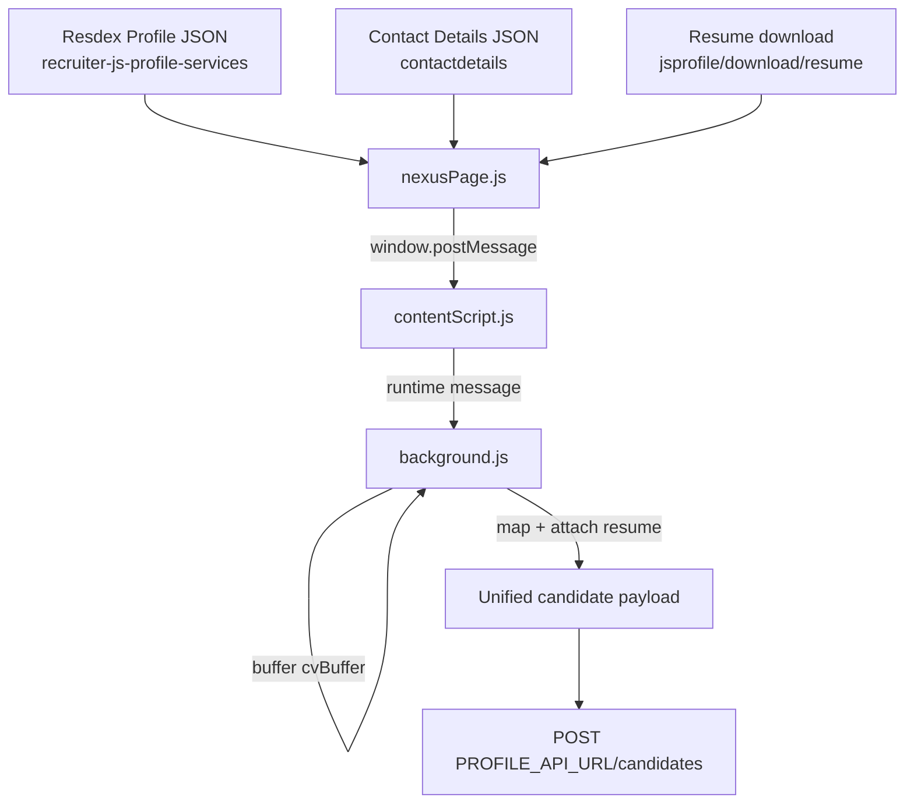

# Extension Technical Documentation
**Project**: Team Collaboration Extension DEV AI  
**Manifest**: MV3 (`public/manifest.json`)  
**Supported job boards**: Naukri/Resdex (`*.naukri.com`), Naukri Hiring (`hiring.naukri.com`), Shine (`*.shine.com`)  

---

## 1. Project Overview

### What the extension does
This extension automates candidate ingestion from job boards into an internal candidate platform by:

- Intercepting job-board APIs (profile, contact info, resume downloads).
- Normalizing the job-board responses into a unified **candidate payload**.
- Sending the payload to the backend **`POST /candidates`**, including the resume in the same request as `cvBuffer`/`cvHtml`.
- Calling **`POST /candidates/verified-ids`** to detect duplicates and render ✓ badges on listing and profile pages.

### Main problem it solves
Recruiting teams often work across multiple job boards with different data shapes. Manual copy/paste of profiles and resumes into an ATS/CRM is slow and error‑prone. This extension provides:

- **Unified ingestion** from multiple job boards into one backend schema.
- **Resume capture** (base64) together with candidate profile data.
- **Duplicate awareness** using verified IDs and UI badges.

### Key features
- **Job-board API interception** (fetch/XHR) via page-context injection.
- **Candidate creation** via `POST /candidates` (single call per candidate).
- **Resume capture** and inclusion via `cvBuffer` (base64) and optional `cvHtml`.
- **Verified-IDs / badges** on:
  - Resdex search (`/v3/search`)
  - Resdex preview (`/v3/preview`)
  - Naukri Hiring application detail pages
  - Shine flows (via SJB handlers/content scripts)
- **Session tooling** (export/import/logout) for Naukri session maintenance.
- **Conflict detection** to avoid duplicate scraping when similar extensions are installed.

---

## 2. Tech Stack

### Extension (browser-side)
- **JavaScript (ES modules)**: background logic, content scripts, interceptor.
- **Chrome Extensions MV3**
  - Background: service worker module (`public/matrixDaemon.js` imports `public/background.js`)
  - Content scripts: injected on target hosts
  - Web-accessible resource: `public/nexusPage.js`

### Popup/UI (developer tooling & auth UI)
- **React** (from `package.json`)
- **Vite** build tooling (scripts: `dev`, `build`, `build:extension`)
- **Tailwind CSS** (via `tailwindcss` and `@tailwindcss/vite`)
- **react-router-dom**, **socket.io-client**

### Backend services used
Configured in `public/config/constants.js`:

- **Candidate/Profile API**: `PROFILE_API_URL`
  - `POST /candidates`
  - `POST /candidates/verified-ids`
  - `POST /candidates/upload-resume` (present, but current flows send resume in `/candidates`)
- **Extension API**: `ETICA_EXT_URL`
  - `GET /profile/me` (user context used by some flows)
  - Session-related endpoints (used by background session import/export utilities)
- **Web App**: `WEB_APP_URL` (opened when clicking ✓ badges)

### Browser APIs used (permissions)
See **Permissions & Security** section for details and rationale.

---

## 3. Architecture

### High-level architecture
The extension is composed of:

- **Page-context interceptor** (`public/nexusPage.js`):
  - Runs in the page’s JS environment.
  - Hooks `window.fetch` and `XMLHttpRequest` to observe job-board API traffic.
  - Extracts JSON and resume content and publishes events via `window.postMessage`.

- **Content scripts** (`public/contentScript.js`, `public/content/utils/*`, `public/content/sjb/*`):
  - Listen for `window.postMessage` events from `nexusPage.js` and forward to the background service worker.
  - Render ✓ badges and refresh UI state based on messages from the background.
  - Handle job-board specific DOM triggers / route detection.

- **Background service worker** (`public/matrixDaemon.js` → `public/background.js`):
  - Central orchestration layer.
  - Aggregates signals (profile + contact + resume), normalizes payload, posts to backend APIs.
  - Handles verified-ids calls and broadcasts matched candidates to content scripts.
  - Maintains session import/export and logout tools for Naukri.

- **Popup UI** (`public/index.html` + `src/*`):
  - Login/user interaction surface.
  - Writes auth token to `chrome.storage.local` for background and content scripts to use.

### Component interaction summary
- `nexusPage.js` → `contentScript.js`: `window.postMessage({ source: "API_INTERCEPTOR", ... })`
- `contentScript.js` → background: `chrome.runtime.sendMessage(message)`
- background → content scripts: `chrome.tabs.sendMessage(tabId, { type: ... })`
- background → backend: `fetch(PROFILE_API_URL + "/candidates", ...)`

---

## 4. Working Flow

### 4.1 Installation & activation
1. Install unpacked extension (developer mode) or packaged build.
2. Open popup (`index.html`) and authenticate; token is stored in `chrome.storage.local` under `authToken`.
3. Navigate to a supported job-board page; the relevant content scripts load and begin listening.

### 4.2 Naukri/Resdex (NJB) profile ingestion flow
1. User opens a candidate preview on Resdex/Naukri.
2. The page triggers job-board APIs:
   - Profile JSON (`recruiter-js-profile-services/...`)
   - Contact JSON (`contactdetails/...`)
   - Resume download (PDF or base64)
3. `nexusPage.js` intercepts those responses and emits events via `window.postMessage`.
4. `public/contentScript.js` forwards these events to the background service worker.
5. `public/background.js`:
   - Buffers data until profile + contact are both available.
   - Buffers resume `cvBuffer` (base64) keyed to the preview context.
   - Builds a unified payload using `mapProfileResponseToCandidatesPayload`.
   - Attaches resume fields (`cvBuffer`, optional `cvHtml`, `cv_updated_at`) in the **same** payload.
   - Sends `POST /candidates`.
6. On success, background:
   - Captures backend `candidateId` from response.
   - Sends messages to render ✓ badges on preview and refresh listing badges.

### 4.3 Naukri Hiring (NH) application ingestion flow
1. User opens a `hiring.naukri.com` application detail page.
2. `nexusPage.js` intercepts:
   - Application detail JSON (`rm-application-detail-services`)
   - Contact details JSON
   - Resume download (`rm-document-services/.../download/applications/<applicationId>`)
3. Background combines app detail + contact + resume and posts `POST /candidates` with resume included.
4. Background sends `NH_DETAIL_BADGE` to paint ✓ on the application detail page.

### 4.4 Shine (SJ) ingestion flow
1. Shine content scripts (`public/content/sjb/*`) scrape the page and produce a normalized candidate payload.
2. Background handler `public/background/sjb/handlers.js` receives the candidate data and resume data.
3. It posts `POST /candidates` including `cvBuffer` in the same payload.
4. It notifies the tab with `SJB_PROFILE_SUCCESS` and refresh signals.

---

## 5. Flow Diagrams

### 5.1 System architecture diagram

```mermaid
flowchart LR
  subgraph Browser
    U[User]
    JB1[Resdex / Naukri]
    JB2[Naukri Hiring]
    JB3[Shine]

    subgraph Extension
      PX[Page Context: nexusPage.js\n(fetch/XHR interception)]
      CS[Content Scripts\n(contentScript.js + SJB scripts)]
      BG[Background Service Worker\nmatrixDaemon.js -> background.js]
      POP[Popup UI\nindex.html + src/]
    end
  end

  subgraph Backend
    PAPI[PROFILE_API_URL\n/candidates, /verified-ids]
    EAPI[ETICA_EXT_URL\n/profile/me, sessions]
    WEB[WEB_APP_URL\ncandidate details]
  end

  U --> JB1
  U --> JB2
  U --> JB3
  U --> POP

  JB1 --> PX
  JB2 --> PX
  JB3 --> CS

  PX --> CS
  CS --> BG
  POP --> BG

  BG --> PAPI
  BG --> EAPI
  CS --> WEB
```

### 5.2 Workflow diagram (candidate ingestion)



### 5.3 Data flow diagram (NJB example)



---

## 6. Implementation Details

### 6.1 Key files and responsibilities

#### Manifest & entrypoints
- **`public/manifest.json`**
  - Declares MV3 background worker (`public/matrixDaemon.js`).
  - Registers content scripts per job board.
  - Declares `nexusPage.js` as a web-accessible resource.
- **`public/matrixDaemon.js`**
  - Service worker entrypoint; imports `public/background.js`.

#### Naukri/Resdex interception and forwarding
- **`public/nexusPage.js`**
  - Intercepts `fetch` and `XMLHttpRequest`.
  - Extracts JSON from profile/contact/app-detail calls.
  - Extracts resume as base64 `cvBuffer` from PDF or raw base64 responses.
  - Posts `{ source: "API_INTERCEPTOR", kind, url, status, data, pathname }` events.
- **`public/contentScript.js`**
  - Forwards `API_INTERCEPTOR` events to background.
  - Resdex route/state detection for `/v3/search`.
  - Renders ✓ badges on cards and preview pages based on background broadcasts.

#### Background orchestration
- **`public/background.js`**
  - Auth cache + helpers.
  - Conflict detection via `chrome.management`.
  - Core ingestion flows:
    - NJB merged profile + contact flow.
    - NH application detail + contact flow.
    - Listing tuples → verified-ids flow.
  - Payload mapping and normalization:
    - `mapProfileResponseToCandidatesPayload(...)`
  - Resume buffering and inclusion:
    - NJB: `pendingResumeByUserId`
    - NH: `nhResumeByApplicationId`
  - Verified-ids calls:
    - `POST /candidates/verified-ids`
  - Badge broadcasting:
    - `NJB_VERIFIED_IDS_MATCHES`, `NJB_PREVIEW_BADGE`, `NH_DETAIL_BADGE`

#### Shine (SJB) pipeline
- **`public/content/sjb/*`**
  - Shine DOM scraping and conversion into unified candidate payload.
- **`public/background/sjb/handlers.js`**
  - Receives Shine candidate payload.
  - Sends `POST /candidates` with `cvBuffer` included.
  - Emits tab events like `SJB_PROFILE_SUCCESS` and badge refresh messages.

### 6.2 Backend endpoints usage

#### `POST /candidates`
- Called by `public/background.js` (NJB and NH) and `public/background/sjb/handlers.js` (SJ).
- Payload: unified schema, including resume fields:
  - `cvBuffer` (base64)
  - `cvHtml` (string or null)
  - `cv_updated_at` (YYYY-MM-DD or null)

#### `POST /candidates/verified-ids`
- Called by `public/background.js` to:
  - Match listing candidates on `/v3/search` tuples.
  - Render badges indicating candidates already present in the backend.

---

## 7. Permissions & Security

### Permissions used and why (`public/manifest.json`)
- **`activeTab`**: Popup actions scoped to the current tab.
- **`tabs`**: Query tabs and send messages for badge updates and refresh.
- **`storage`**: Persist auth token, conflict flags, and session artifacts.
- **`cookies`**: Export/import/logout for Naukri sessions.
- **`scripting`**: Read/write localStorage/sessionStorage during session import/export.
- **`browsingData`**: Clear caches/cookies before importing session to avoid conflicts.
- **`notifications`**: User-visible success/failure messages.
- **`system.cpu`**: Used for device/platform telemetry/diagnostics (not critical to scraping).
- **`management`**: Detect conflicting extensions that share host permissions.

### Host permissions
- Naukri/Resdex: `*://*.naukri.com/*`
- Naukri Gulf: `*://*.naukrigulf.com/*`
- Shine: `*://*.shine.com/*`

### Security considerations
- **Token storage**: auth token is stored in `chrome.storage.local` and attached as `Authorization: Bearer ...` in background requests.
- **Page-context isolation**: `nexusPage.js` runs in the page context, but only communicates outward via `window.postMessage`. The content script filters messages by `source: "API_INTERCEPTOR"`.
- **Conflict prevention**: background checks conflict state and skips ingestion if another similar extension is detected.
- **Data handling**:
  - Resume is transmitted as base64 `cvBuffer` to backend via HTTPS endpoints.
  - Avoid logging raw resume content in production builds.

---

## 8. Setup & Installation

### Development prerequisites
- Node.js (for Vite and build scripts)
- Chrome/Chromium (for MV3 extension testing)

### Install dependencies

```bash
npm install
```

### Run popup UI (Vite dev server)

```bash
npm run dev
```

### Build popup/UI bundle

```bash
npm run build
```

### Build extension (packaging scripts)
- **With obfuscation**:

```bash
npm run build:extension
```

- **Without obfuscation**:

```bash
npm run build:extension:no-obf
```

### Load unpacked extension in Chrome
1. Open `chrome://extensions`
2. Enable **Developer mode**
3. Click **Load unpacked**
4. Select the folder containing `public/manifest.json` (project root in this repo layout)

### Environment configuration
- Popup uses `src/config/api.js` → `import.meta.env.VITE_API_URL` (set via `.env`).
- Backend endpoints used by background scripts are in `public/config/constants.js`.

---

## 9. Challenges & Solutions

### Intercepting job-board responses reliably
- **Challenge**: content scripts cannot directly access all page runtime network calls in a reliable, structured way.
- **Solution**: inject `public/nexusPage.js` into the page context and intercept both `fetch` and XHR, then forward structured events to the extension.

### Correlating resume with the correct candidate
- **Challenge**: resume downloads may not contain stable identifiers that match profile/contact payloads.
- **Solution**:
  - Buffer resume temporarily (base64) keyed by preview/application context.
  - Attach resume fields to the next `POST /candidates` payload once profile + contact are ready.

### Preventing duplicate ingestion
- **Challenge**: SPA navigation and multiple intercepts can cause repeated `/candidates` calls.
- **Solution**: dedupe with request signatures (per userId/applicationId) and time-window guards in background.

### Avoiding conflicts with similar extensions
- **Challenge**: multiple extensions on the same hosts can double-intercept and spam APIs.
- **Solution**: detect overlaps via `chrome.management` and suspend ingestion when a conflict is present.

---

## 10. Future Improvements
- **Formalize adapters** per job board (NJ/NH/SJ) using a standard interface to simplify adding new sources.
- **Improve resume fallback** when resume arrives late (after `/candidates`) by persisting and retrying on next view.
- **Reduce permission surface** by auditing and minimizing where possible.
- **Add diagnostics UI** in popup (last ingestion status, errors, conflict state, verified-ids results).
- **Config via env** for backend URLs to reduce code changes between environments.

